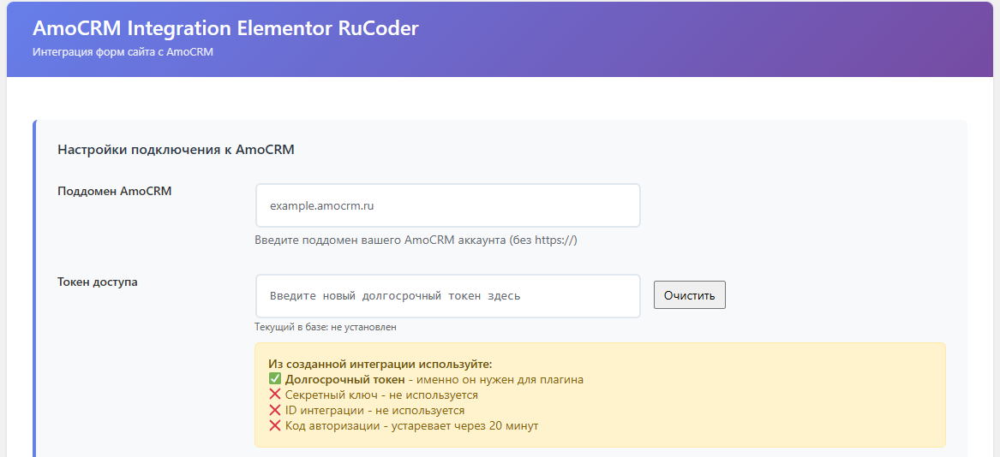
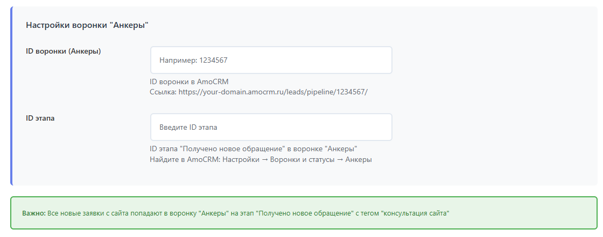
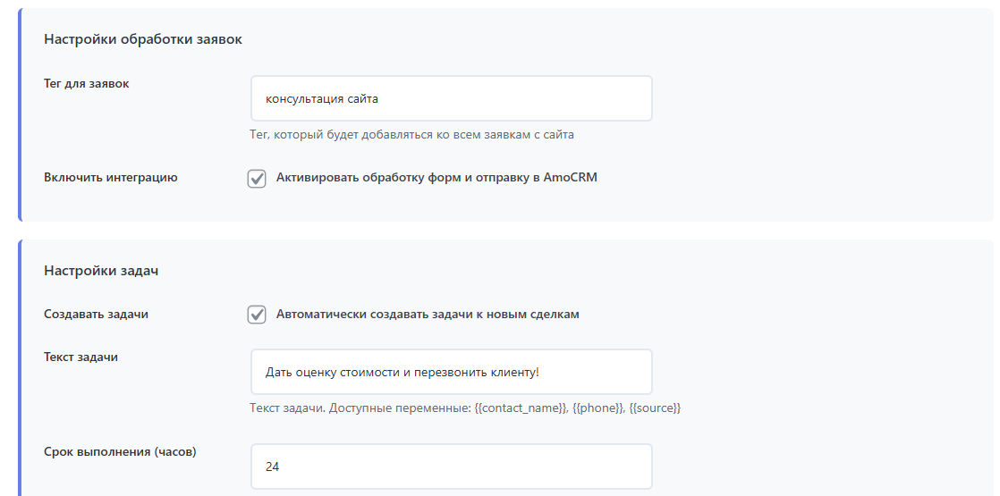
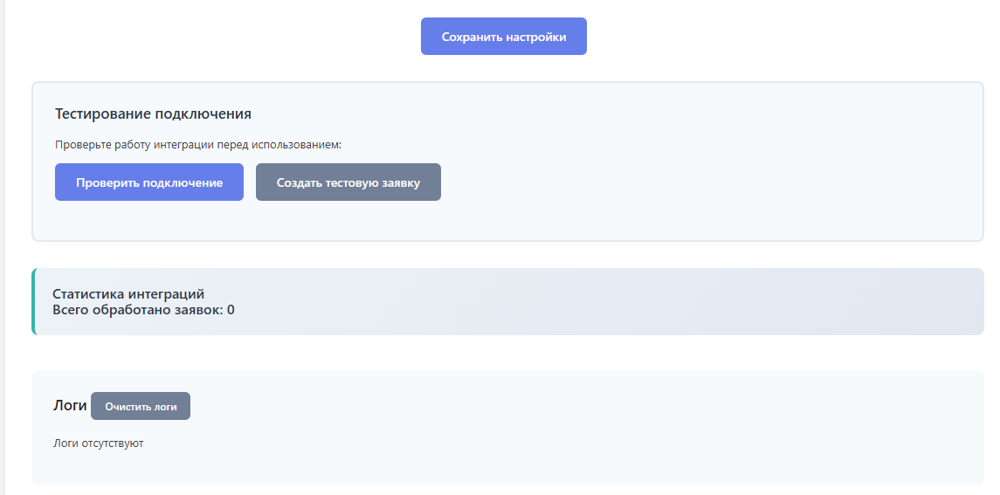

# AmoCRM Integration Elementor RuCoder

Полнофункциональная интеграция форм сайта с AmoCRM. Автоматически обрабатывает заявки с Elementor Pro форм и кнопок связи, создает контакты и сделки в воронке "Анкеры" с тегами и задачами.

## Автор
**Сергей Солошенко (RuCoder)**
- Версия: 3.1
- Специализация: Веб-разработка с 2018 года | WordPress / Full Stack
- Email: support@рукодер.рф
- Telegram: @RussCoder
- GitHub: https://github.com/RuCoder-sudo

## Возможности

### ✅ Интеграция с формами
- **Elementor Pro формы**: Автоматически определяет поля (name, comaniya, email, tel, message).
- **Кнопки связи**: Поддержка классов `arcu-field`.
- **Quizle квиз**: Полная поддержка событий `quizle:start`, `quizle:finish`, `quizle:submit_contacts`.
- **Popup Maker**: Отслеживание форм во всплывающих окнах.

### ✅ Функции AmoCRM
- Создание контактов с телефоном и email.
- Создание сделок в указанной воронке.
- Автоматическое добавление тега "консультация сайта".
- **Создание задач**: Автоматическое создание задач к сделкам с настраиваемым текстом и сроком выполнения.

### ✅ Административные функции
- Стильная админ-панель с настройками.
- Тестирование подключения API.
- Создание тестовых заявок.
- Логирование всех операций и статистика.

## Установка

1. Скопируйте папку `amocrm-ele-rucoder` в директорию `/wp-content/plugins/` вашего WordPress сайта.
2. Активируйте плагин в админ-панели WordPress: **Плагины → Установленные**.
   > **Важно:** Убедитесь, что активирована версия 3.1 от Сергея Солошенко (RuCoder).
3. Перейдите в **Настройки → RuCoder AmoCRM** для конфигурации.

## Настройка

### 1. Получение токена доступа AmoCRM
1. Войдите в ваш AmoCRM аккаунт.
2. Перейдите в **Настройки → Интеграции → API и Webhooks**.
3. Создайте новую интеграцию или откройте существующую.
4. Скопируйте **Долгосрочный токен доступа**.

### 2. Конфигурация плагина
В админ-панели WordPress перейдите в **Настройки → RuCoder AmoCRM**:

- **Поддомен AmoCRM**: `your-domain.amocrm.ru` (или ваш поддомен).
- **Токен доступа**: Вставьте скопированный долгосрочный токен.
- **ID воронки (Анкеры)**: Ваш ID воронки.
- **ID этапа**: ID этапа "Получено новое обращение".
- **Тег для заявок**: `консультация сайта`.
- **Включить интеграцию**: ✅
- **Создавать задачи**: ✅ (опционально).
- **Текст задачи**: Используйте переменные `{{contact_name}}`, `{{phone}}`, `{{source}}`.
- **Срок выполнения**: Количество часов (по умолчанию 24).

## Тестирование и Отладка

Внизу страницы настроек есть инструменты для проверки:
- **Проверить подключение**: Тест связи с API.
- **Создать тестовую заявку**: Генерирует тестовый лид для проверки воронки.
- **Логи**: Подробный журнал операций (API запросы, ответы, ошибки).
- **Очистить логи**: Удаляет старые записи журнала.

## Технические данные

### Поддерживаемые поля Elementor Pro
```
name, comaniya, email, tel, message
ID форм: formhome, formpupe
```

### Маркетинговые данные
Плагин автоматически передает:
- UTM метки (`utm_source`, `utm_medium` и др.)
- Google Client ID, Yandex Metrica Client ID
- Roistat Visit ID
- IP адрес, User Agent, Geo-данные

## История изменений

### Версия 3.1
- **Исправлено**: Проблема с дублированием тегов (переход на PATCH метод).
- **Добавлено**: Функция автоматического создания задач.
- **Улучшено**: Механизм сохранения и очистки токенов для повышения стабильности.

## 📸 Скриншоты проекта

### Основной интерфейс


### Настройки плагина  


### Интеграция с amoCRM


### Результаты работы

